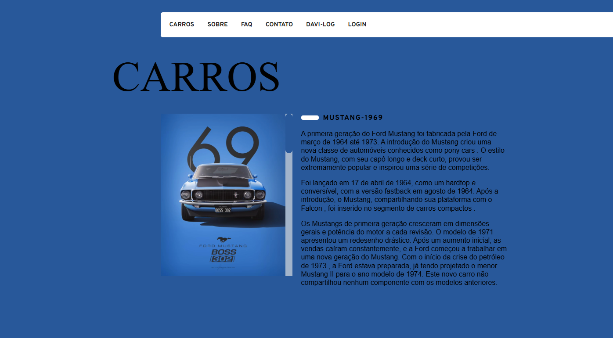

# Carros-iconicos
 
Este é um projeto de estudo, desenvolvido com base no projeto "Animais Fantásticos" do curso de programação em JavaScript da Origamid. Durante o curso, tive a oportunidade de aprender e aprofundar meus conhecimentos na linguagem. "Animais Fantásticos" foi o projeto principal do curso, e utilizei-o como inspiração para criar este projeto.

Ferramentas utilizadas:
HTML, CSS e JavaScript ES6+.

Para acessar: [Clique aqui!](https://davi-devroom.github.io/Carros-iconicos/)

